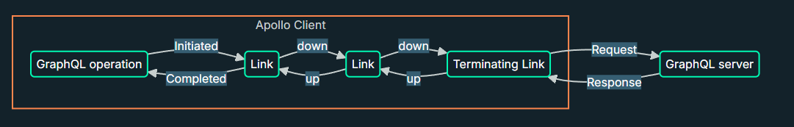

# Apollo Link overview

Apollo Client 内部で使われる、リクエスト・レスポンス処理の拡張をする際に Apollo link というものを用いる。

例えば、認証トークンの付与や、ロギングなどである。イメージとしてはミドルウェアのような構造での動作を実現させるのに近いのかもしれない（？）

処理を拡張するには link オブジェクトと呼ばれるものをチェーンしていく。

下記の例で行くと、

1. GraphQL の何らかの操作（e.g. mutation）が行われる
2. 最初の Link でロギングする
3. 2番目の Link で認証トークンを付与
4. 操作を GraphQL サーバーに送信
5. サーバーからのレスポンスを逆伝播させる



実装に起こすならこんな感じらしい（雑に GPT から引っ張ってきただけ）

```typescript
import { ApolloClient, InMemoryCache } from '@apollo/client'
import { HttpLink } from '@apollo/client/link/http'
import { ApolloLink, from } from '@apollo/client/link/core'
import { onError } from '@apollo/client/link/error'

// 1. エラー処理用のリンク
const errorLink = onError(({ graphQLErrors, networkError }) => {
  if (graphQLErrors) {
    graphQLErrors.forEach(({ message, locations, path }) => {
      console.error(`[GraphQL error]: Message: ${message}, Location: ${locations}, Path: ${path}`)
    })
  }

  if (networkError) {
    console.error(`[Network error]: ${networkError}`)
  }
})

// 2. デバッグ用のリンク（リクエストとレスポンスをコンソールに出力）
const debugLink = new ApolloLink((operation, forward) => {
  console.log(`[Debug] Starting request for: ${operation.operationName}`)
  console.log(`[Debug] Variables:`, operation.variables)

  // `forward(operation)` は次のリンクへ処理を渡す（最終的にサーバーへリクエスト）
  return forward(operation).map((result) => {
    console.log(`[Debug] Received response for: ${operation.operationName}`)
    console.log(`[Debug] Result:`, result)
    
    return result
  })
})

// 3. HTTP 通信を行うリンク
const httpLink = new HttpLink({
  uri: 'https://example.com/graphql'
})

// 4. リンクをまとめる
// 上から順に実行され、最終的に httpLink からサーバーへリクエストが送られる
const link = from([
  debugLink,
  errorLink,
  httpLink
])

// 5. Apollo Client を作成
const client = new ApolloClient({
  link,
  cache: new InMemoryCache()
})
```

必要に応じて link を用意して、4 の部分に含むことでさらなる拡張も出来る

## 参考

- [Apollo Link の概要 - Apollo GraphQL ドキュメント](https://www.apollographql.com/docs/react/api/link/introduction)