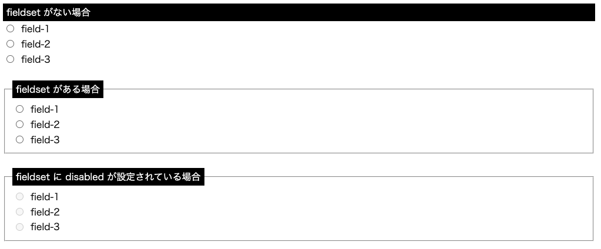

# fieldset

HTML フォームの一部をグループ化する要素で、以下のようなことができる

- 視覚的なグルーピング: 枠線が付与される他、`<legend>` と組み合わせるとキャプションも付与できる
- セマンティクス: アクセシビリティの向上（スクリーンリーダーがグループとして認識してくれる）や開発者へ意図を伝えやすくする
- 一括無効化: `<fieldset disabled>` とすることで子孫要素のフォームコントロールが全て無効に
- フォームとの柔軟な関連付け: `<fieldset form="form-id">` とすることで `<form id="form-id">` の外に置かれていてもこのフォームに属する入力として扱える

## 参考

- [`<fieldset>`: フィールドセット要素 - HTML: ハイパーテキストマークアップ言語 | MDN](https://developer.mozilla.org/ja/docs/Web/HTML/Reference/Elements/fieldset)
