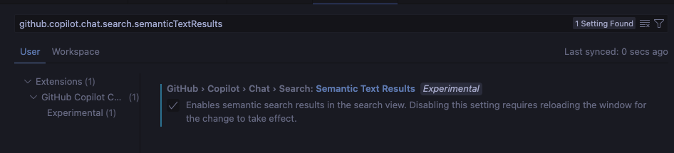

# Semantic Text Search

VSCode での検索時に AI を活用したセマンティックテキスト検索ができるようになった。

## 設定方法

1. `⌘` + `,` などで設定を開く
2. `github.copilot.chat.search.semanticTextResults` を ON にする
3. 検索バーで自然言語による検索をする

<video src="./assets/demo-semantic-text-results.mp4"></video>

## 参考

- [Visual Studio Code の Copilot スマートアクション](http://code.visualstudio.com/docs/copilot/copilot-smart-actions#_semantic-search-results)
