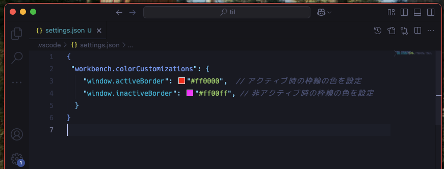
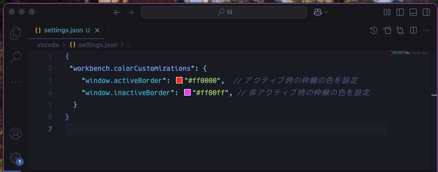

# Window border color

VSCode のウィンドウの枠線に色をつけれることを知った。

複数窓開いてる状態だとどの窓がどのワークスペースのものか分からなくなることがあるので、識別しやすくなって助かる。

## 設定方法

`.vscode/settings.json` などの設定ファイルで以下を記載

```json
{
 "workbench.colorCustomizations": {
    "window.activeBorder": "#ff0000",  // アクティブ時の枠線の色を設定
    "window.inactiveBorder": "#ff00ff", // 非アクティブ時の枠線の色を設定
  }
}
```

## 見え方

### アクティブ時



### 非アクティブ時



## 参考

- [Theme Color | Visual Studio Code Extension API](https://code.visualstudio.com/api/references/theme-color#window-border)

