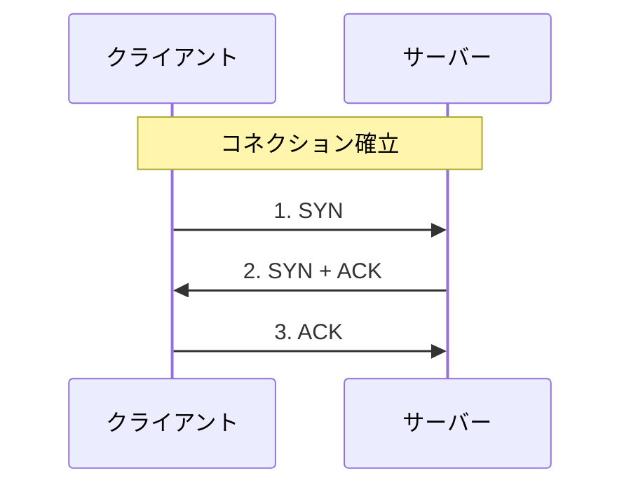
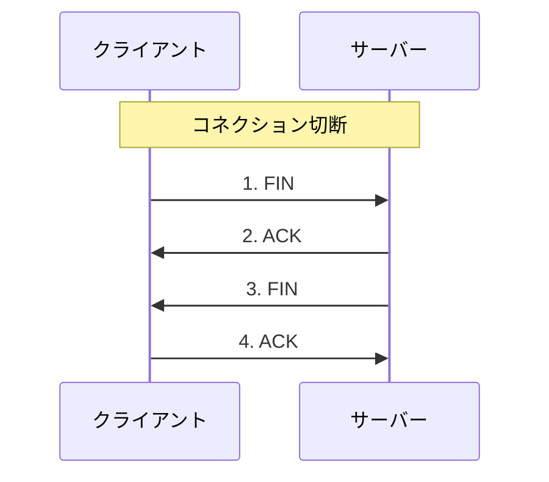
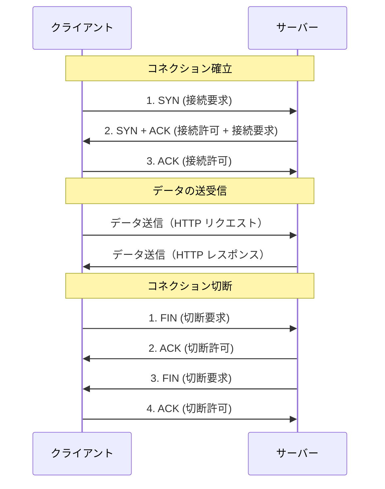

# 3 Way Handshake

## 概要

TCP がクライアントとサーバーがお互いに通信できる状態を確認し、コネクション（通信経路）を確立したうえでデータのやりとりを行う

このコネクションの確立は3回のやり取りによって行われるため 3 way handshake と呼ばれる

## コネクション確立

コネクションを確立するには

1. クライアントがサーバーに対し「接続していいか？」と確認する
2. サーバーは 1 に対する返事 ( e.g. 「いいよ！」 ) とクライアント側への確認 ( 「こっちからも接続していい？」 ) をする
3. クライアントは 2 の確認に対する返事 ( e.g. 「いいよ！」 ) をする

という 3 STEP で行われる

TCP ヘッダー内には SYN, ACK という接続要求や確認応答を行うフラグを表すものが含まれており、これらのフラグの状態からその通信が何をお願いするものなのかが分かるようになっている

- SYN (Synchronize): 同期・接続開始の要求を意味
- ACK (Acknowledgment): 確認応答を行うことを意味

コネクションの確立がされると HTTP のデータ送受信などが行われる

## コネクション切断

コネクションの切断についても合わせて述べる

切断は 4 STEP になる ( 3 way handshake なのはあくまでも確立時の話 )

1. クライアントからサーバーに「切断していい？」と確認する
2. サーバーからクライアントに 1 に対する返事 ( e.g. 「いいよ！」 ) を行う
3. サーバーからクライアントに対しても「切断していい？」と確認する
4. クライアントからサーバーに 3 に対する返事 ( e.g. 「いいよ！」 ) を行う

ACK は接続時に説明したのと同様に確認応答を示し、 FIN ( Finish ) は切断確認を示す

## 全体像

## 備考

本当は Sequence についても触れたいが言語化が上手く出来てないので、将来理解し直したときに追記する

## 参考

- [イラスト図解式 この一冊で全部わかるWeb技術の基本 第2版 | SBクリエイティブ](https://www.sbcr.jp/product/4815625948/)
  - P.60, 61
- [3ウェイ・ハンドシェイク - Wikipedia](https://ja.wikipedia.org/wiki/3%E3%82%A6%E3%82%A7%E3%82%A4%E3%83%BB%E3%83%8F%E3%83%B3%E3%83%89%E3%82%B7%E3%82%A7%E3%82%A4%E3%82%AF)
