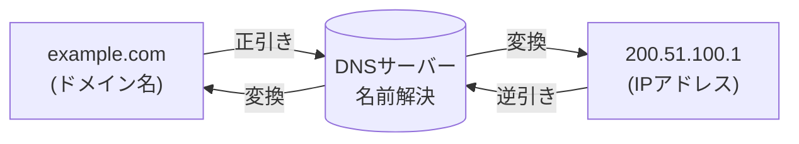

# DNS (Domain Name System)

## 概要
ドメイン名とIPアドレスの対応付け管理をするシステムのこと

インターネット上でコンピュータ同士が接続するには IP アドレスが必要だが、数字での表現なので人間には分かりづらい。
そこで、IP アドレスに対して人間が理解できるよう文字列で表記したドメイン名を利用し、 IP アドレスとドメイン名を対応付ける。
これによって、人間が通信先として指定したドメインに対応したIPアドレスをコンピュータは把握でき、通信が行える（逆も然り）

IP アドレスをドメイン名に変換する、あるいはその逆を行うことを名前解決といい、

- 正引き: ドメイン名からIPアドレスに変換
- 逆引き: IPアドレスからドメイン名に変換

という

## 参考

- [DNSとは｜「分かりそう」で「分からない」でも「分かった」気になれるIT用語辞典](https://wa3.i-3-i.info/word1287.html)
