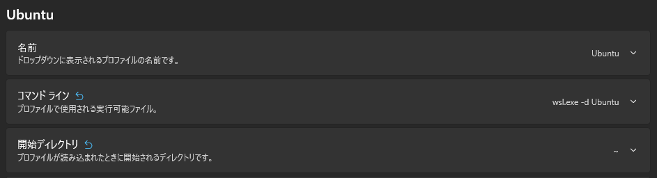

# ubuntu.exe Does Not Preserve Current Directory

## 概要

Window の提供するターミナルアプリ上で ubuntu を動かしている際のタブ複製の挙動が意図したとおりにならなくて解消した時の備忘録

### 発端

- ターミナルアプリ上ではデフォルトで現在のタブを複製した際に元タブのカレントディレクトリを引き継げるようになっていない
- [Microsoft の公式ドキュメント](https://learn.microsoft.com/en-us/windows/terminal/tutorials/new-tab-same-directory)を参考に `.zshrc` に下記設定をしたが、動作しなかった

```sh
keep_current_path() {
  printf "\e]9;9;%s\e\\" "$(wslpath -w "$PWD")"
}
precmd_functions+=(keep_current_path)
```

### 原因

- 自分がターミナル上で設定できる Ubuntu は起動設定が2種類あった
  - 1. `ubuntu.exe` を実行して呼び出す
  - 2. `wsl.exe -d ubuntu` を実行して呼び出す
  - いずれも最終的には同じ Ubuntu を呼び出しているのだが起動方法が異なる
- `$ ubuntu.exe --help` より、 `ubuntu.exe` は引数がない場合は常にホームディレクトリで起動する

### 最終的な起動方法

以下のいずれかを実施すれば良い

1. `wsl.exe -d Ubuntu` が起動コマンドになっている Ubuntu のプロファイルを使う
2. `ubuntu.exe` を起動コマンドになっているプロファイルのコマンド `wsl.exe -d Ubuntu` にする

1のプロファイルがあるなら1を、無い場合は2を設定すると良いと思う



## 備考

- Ubuntu の設定で開始ディレクトリを「親プロセスディレクトリの使用」にすると、`c/Windows/System32` になる
  - 人によってやや異なるかも？
  - Ubuntu 上を開始ディレクトリにしたい場合は `~` を指定すると良い（ホームディレクトリに飛ばされるようになる）
  - この挙動はタブ複製には関係しない

## 参考

- [Tutorial: Open a new tab in the same directory | Microsoft Learn](https://learn.microsoft.com/en-us/windows/terminal/tutorials/new-tab-same-directory): Windows Terminal で新しいタブを同じディレクトリで開く公式チュートリアル
- [WSL.exe and ubuntu.exe are different - Stack Overflow](https://stackoverflow.com/questions/55662585/wsl-exe-and-ubuntu-exe-are-different): ubuntu.exe と wsl.exe の違い
- [Issue #12961: Starting Windows Terminal in a specific directory always opens to HOME for Linux profiles](https://github.com/microsoft/terminal/issues/12961): 同様の問題報告
- [Issue #12978: OSC 9;9 not working in WSL 2/Ubuntu?](https://github.com/microsoft/terminal/issues/12978): OSC 9;9 が動かない問題
