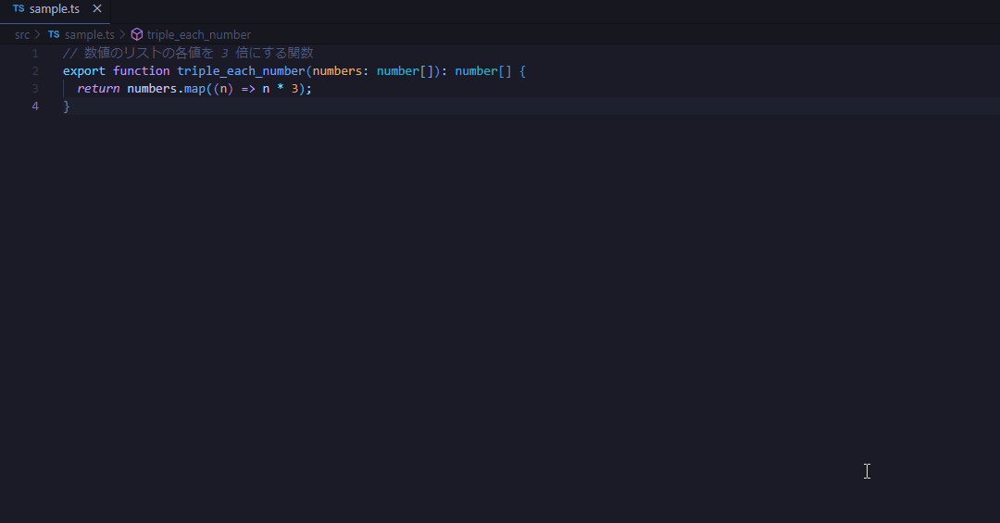

# Custom Instructions

Github Copilot では Custom Instructions を定義することで、 VSCode などで Copilot を使ってる際にチームのコーディングルールなどを反映したレスポンスを返してくれるようになる

基本的にやることとしては

1. `.github` ディレクトリ内に `copilot-instructions.md` ファイルを作成
2. 1 で作成した markdown ファイルに対応してほしい内容を自然言語で記載

の2ステップだけ

これによって、例えば以下の記述を `.github/copilot-instructions.md` に書いて、これに反したコードの修正を行うことができる

```.github/copilot-instructions.md
# コーディングガイドライン

- 関数宣言はアロー関数を使うこと
- 変数名はキャメルケースを使うこと
- JSDoc を記述すること
```



## instruction の細分化

`./github/instructions/` に `.instructions.md` 形式のファイルを追加することで、指示をファイル分割できる

front matter として `applyTo` を使うことができ、ここにディレクトリやファイルを指定することで、その `.instruction.md` の適用範囲を絞ることができる

例えば、`src/app/*.tsx` にだけ適用したい場合、以下のように書ける

```md
---
applyTo: "src/app/*.tsx"
---

以下指示を記載
```

## Prompt files

`.prompt.md` 形式のファイルによってプロンプトをチャットで参照させることができる。

スコープが2種類あり、それぞれファイルの作成方法が異なる

- ワークスペース内でのみ使用: `.github/prompts/` に配置
- 複数ワークスペースで使用: VSCode の設定から `Chat: New Prompt File` で設定


front matter に以下の3つを定義できる

- `mode`: どのチャットモード(ask, edit, agent)で使用するか
- `tools`: エージェントモードで使用できるツールリスト。チャット入力フィールドに `#` と入力すると表示される（関数的なものという認識）
- `description`: プロンプトの説明

つまり、以下のように書く

```md
---
mode: 'agent'
tools: ['githubRepo', 'codebase']
description: 'Generate a new React form component'
---

以下指示を記載
```

### prompt と instruction の使い分け（個人的感想）

Roo code の [Custom Modes](https://docs.roocode.com/features/custom-modes) みたいな扱いを prompt で行うといいのかもと思う。

prompt を AI にやってもらいたいタスクをこなすモード (e.g. refactor, architect)毎の振る舞いを用意し、instruction には言語やフレームワーク毎の振る舞いを用意する。

これによって、「React × リファクタリング」なタスクの振る舞いが用意できる…はず。

それとは別に具体的なタスク（e.g. トップ画面に検索機能を実装）を定義するためのものも prompt に用意しておくことで、どのような指示を出したのかを記録・共有しやすくなりそう。

## 感想

チーム内でのスタイルガイドをバージョン管理出来るという副次的効果もあり、個人的には大分嬉しさを感じた

## 参考

- [GitHub Copilot のカスタム指示の追加 - GitHub Docs](https://docs.github.com/ja/copilot/customizing-copilot/adding-custom-instructions-for-github-copilot)
- [GitHub Copilot in VS Code でカスタムインストラクションを利用可能になりました | DevelopersIO](https://dev.classmethod.jp/articles/custom-instructions-now-available-in-github-copilot-in-vs-code/)
- [上記記事の内容（前述された動作例）を試せるリポジトリ](https://github.com/Signa-ling/custom-instructions-sample)
