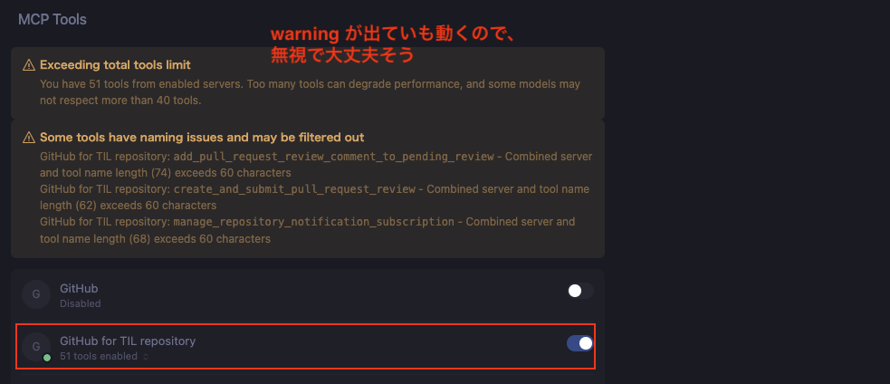

# Setting Github MCP Server

PR の作成等を Cursor などに搭載されている AI によって自動で行えるようにしたいと考えたのがきっかけ。

ざっくり以下の3ステップで作業を進めるとできる

1. Github 上での PAT (Personal Access Token) の発行
2. エディタ（ツール）側での MCP の設定
3. 動作確認

## 前提

- ここでのゴールはこの TIL のリポジトリにある PR の情報を Cursor の AI に取得してもらうこととする
- 以降の項目では適宜自分が取得したい情報やツールに応じて読み替えること

## 1. Github 上での PAT (Personal Access Token) の発行

MCP でアクセスするためのリポジトリや、その中でどういうことが行えるかの権限に関するものを発行する。
これが、 AI が MCP を介して操作するときにできることに相当する。

PAT は以下の箇所から設定できる。

`Settings > Developer Settings > Personal access tokens > Fine-grained personal access tokens`


`Generate new token` を押すことでその token で何ができるかの権限を設定できる。設定項目についてはざっくり以下の通り。

- Token name: PAT の名前
- Description: その PAT に関する説明
  - 任意だが、書いておくと役割が明確になって良い
- Resource owner: 誰のリポジトリに対するアクセスがしたいか
  - 企業のリポジトリなどにアクセスする場合、ここを切り替えないと後述の Repository Access でアクセスしたいリポジトリが表示されない
  - 選べるのは自分か所属中の団体などに限られると思われる
- Expiration: この PAT の利用期限
  - 安全性を考慮するなら短めの方が望ましそう
- Repository access: Resource owner で選んだ対象のどのリポジトリにアクセスしたいか
  - 安全性を考慮するなら Only select repositories で対象を選んでおいた方が望ましそう
- Permissions: 下記2項目について、アクセス不可、読み取り専用、読み書き可の3つが選べる
  - Repository permissions: Repository access で選んだリポジトリの何を操作するか (e.g. Pull Request の読み取りを行えるようにする)
  - Account Permissions: PAT の持ち主のアカウントの設定の何を操作するか ( e.g. メールアドレスの読み取りを行えるようにする)

### 設定例

今回は TIL の PR 情報を取得したいので、設定としては以下のようになる（特に赤枠部分が重要）


Repository permissions は下記の通り


Token が発行されるのでコピーする


## 2. エディタ（ツール）側での MCP の設定

Cursor の場合はまず、https://docs.cursor.com/tools にアクセスし、 Github MCP Server を追加


追加すると Cursor 側で以下のような画面が開けるので、 1 で発行した token を貼り付けて install


作成した MCP Server を有効化



### 余談

この MCP の設定の実態は json で、少なくとも Cursor では以下のようになっている。
恐らく他ツールでも同様に設定すれば良いので、参考までに。

```json
// mcp.json
{
  "mcpServers": {
    "GitHub for TIL repository": {
      "command": "docker run -i --rm -e GITHUB_PERSONAL_ACCESS_TOKEN ghcr.io/github/github-mcp-server",
      "env": {
        "GITHUB_PERSONAL_ACCESS_TOKEN": "1 で用意した token"
      }
    }
  }
}
```

## 3. 動作確認

AI に以下のような指示を出してみる（以下は Cursor で指示）

```md
@https://github.com/Signa-ling/til/pull/1 でやってることを説明して
```

この返答結果として、MCP を介して正しい内容が返ってくれば OK
以下は返答例で、問題なく返ってきているためこれで達成と言える。


## 備考

もしかすると `gh` コマンドとかでも代用できる部分があるかもしれない

## 参考

- [Managing your personal access tokens - GitHub Docs](https://docs.github.com/en/authentication/keeping-your-account-and-data-secure/managing-your-personal-access-tokens)
- [github/github-mcp-server: GitHub's official MCP Server](https://github.com/github/github-mcp-server)
- [Cursor – Model Context Protocol](https://docs.cursor.com/context/model-context-protocol)
