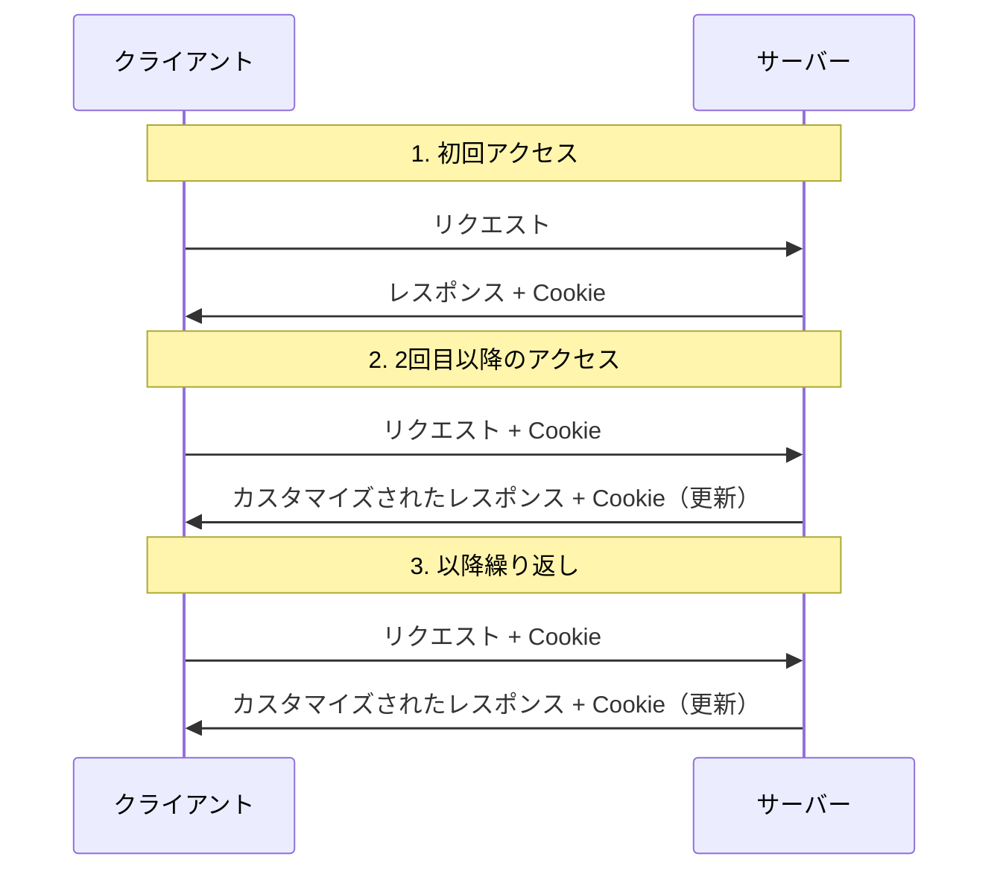

# Cookie

## 前提

- HTTP はもともとファイル転送を行うために開発されたため、状態を保持させる必要がなかった（ステートレスで良かった）
- WWW の普及に伴ってステートレスで困るケースが増えてきた
  - 例えば、ショッピングサイトにおいてカートに商品を入れた状態にしておくなど

## 概要

ステートレスプロトコルである HTTP 上でステートフルなサービスを実現するための仕組みのこと

以下のような仕組みでサーバーとクライアント間の状態が管理される



1. サーバーにアクセスしたクライアントに対し、クライアント側で保持しておいてもらいたい情報を Cookie として送る
2. 次にもう1度同じサーバーへ接続したときに、クライアントは保持していた Cookie をサーバーに送る
3. 送られた Cookie を元にサーバーはコンテンツの内容をそのクライアントに合ったものにカスタマイズして返す（必要に応じて追加の情報を Cookie として渡す）
4. 以後2, 3 を繰り返す

上記やり取りの中で Cookie は HTTP ヘッダーに含める形で送っている

1 のタイミングで送られてくるレスポンスに `Set-Cookie` ヘッダーとして以下のような形式で設定される

```http
Set-Cookie: <cookie-name>=<cookie-value>
```

もう少し具体的に書くと以下のような形式

```http
HTTP/2.0 200 OK
Content-Type: text/html
Set-Cookie: yummy_cookie=choco
Set-Cookie: tasty_cookie=strawberry

[ページの内容]
```

複数の Cookie がある場合は別個に設定できる

2でクライアントからサーバーにリクエストを行う時は、 `Cookie` ヘッダーに前回格納された Cookie を含める

```http
GET /sample_page.html HTTP/2.0
Host: www.example.org
Cookie: yummy_cookie=choco; tasty_cookie=strawberry
```

## セッション Cookie と永続 Cookie

Cookie には Web ブラウザが閉じられると同時に削除されるセッション Cookie と、有効期限が設定されている代わりに Web ブラウザを閉じても削除されない永続 Cookie がある

上記までの例はセッション Cookie である

永続 Cookie は以下のいずれかの属性で期限が設定されたもので、それぞれの期限日 / 期間を過ぎた際に削除される

- `Expires`属性で設定された有効期限日を過ぎる
- `Max-Age` 属性によって指定された期間を過ぎる

```http
# Expires で設定する場合
Set-Cookie: id=a3fWa; Expires=Thu, 31 Oct 2021 07:28:00 GMT;

# Max-Age で設定する場合
Set-Cookie: id=a3fWa; Max-Age=2592000;
```

## 参考

- [イラスト図解式 この一冊で全部わかるWeb技術の基本 第2版 | SBクリエイティブ](https://www.sbcr.jp/product/4815625948/)
  - P.76, 77
- [HTTP Cookie の使用](https://developer.mozilla.org/ja/docs/Web/HTTP/Guides/Cookies)
- [HTTP cookie - Wikipedia](https://ja.wikipedia.org/wiki/HTTP_cookie)
