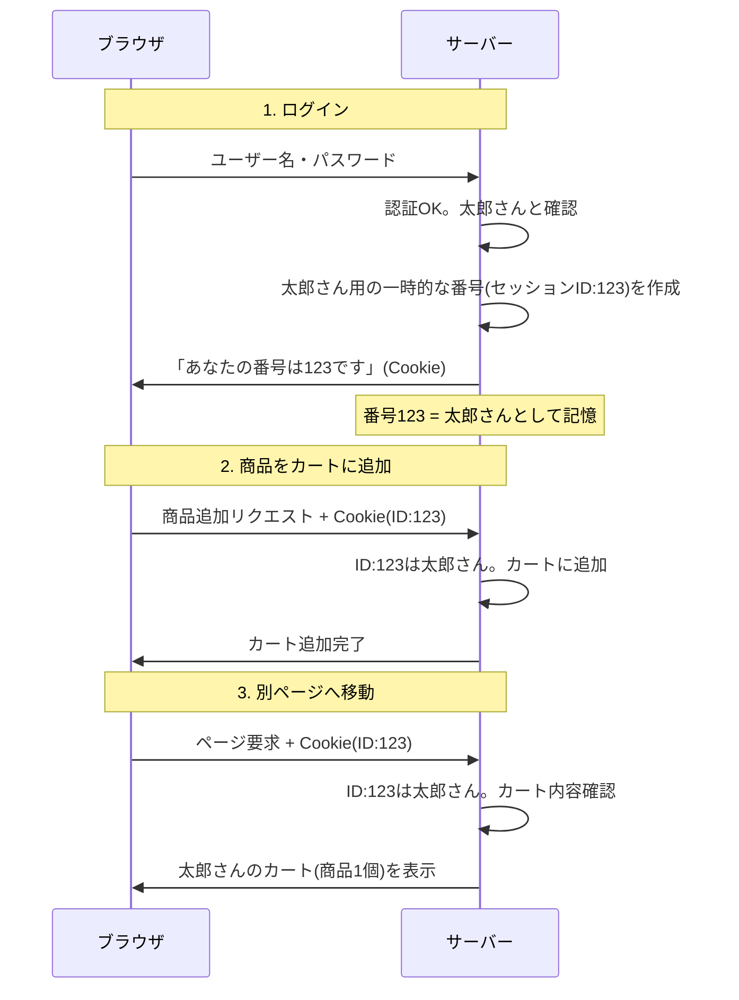

# Session

## 概要

Web 上でのクライアントとサーバーとのやりとりにおいて、一連の関連性のある処理の流れのこと

オンラインショッピングの例を示す。

このように Cookie にセッション ID を含めたやり取りを行うことで、サーバー側はリクエストの都度誰の操作かを元に必要な情報を適切に返すことができる。

これがない場合、上記例だと

- 都度ユーザー情報を送る必要がある: 画面遷移のたびにログインを要求
- ショッピングカードの状態が維持できない

といったことが起こる。

## 参考

- [イラスト図解式 この一冊で全部わかるWeb技術の基本 第2版 | SBクリエイティブ](https://www.sbcr.jp/product/4815625948/)
  - P.78, 79
- [セッションとは｜「分かりそう」で「分からない」でも「分かった」気になれるIT用語辞典](https://wa3.i-3-i.info/word1791.html)
