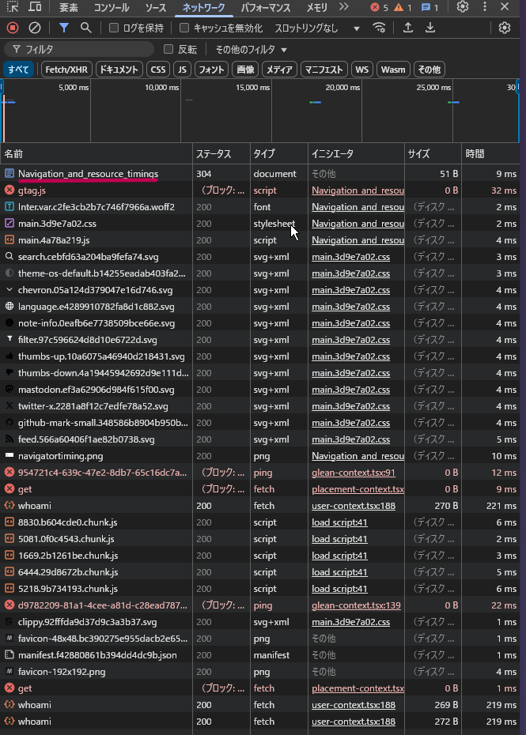
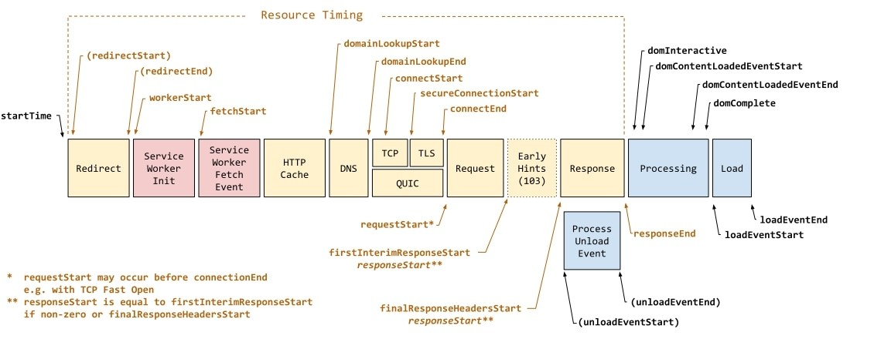
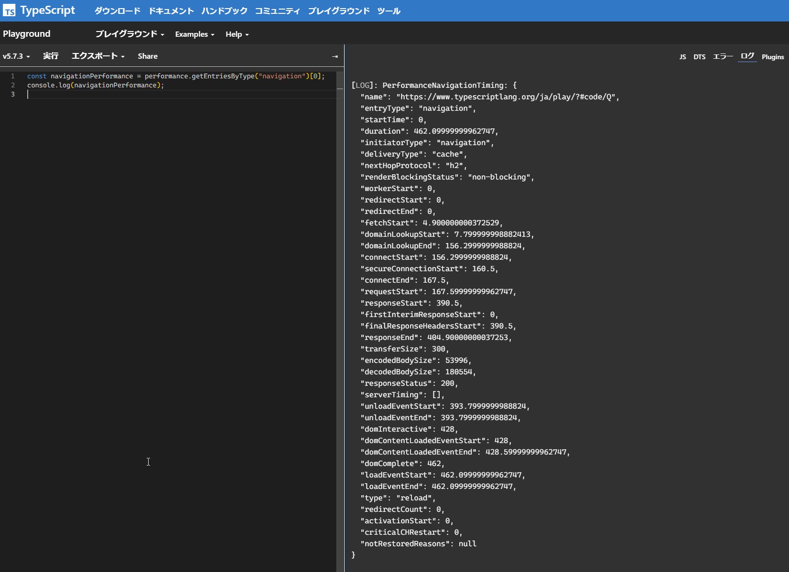

# Performance Navigation Timing API

ブラウザ側から計測をする際に調べた。ざっくり言うと、ブラウザのメインドキュメント（図の赤下線引いてる部分）のタイミングを測定するための API とのこと。 



## 計測内容

[MDN](https://developer.mozilla.org/en-US/docs/Web/API/Performance_API/Navigation_timing) によると以下の図にある区間のタイムスタンプが計測される



以下ざっくり説明

- startTime: 計測開始時刻（0 から始まる）
- Redirect: ページにリダイレクトがある場合はこの区間で行われる
- Service Worker Init / Service Worker Fetch Event: [サービスワーカー](https://developer.mozilla.org/ja/docs/Web/API/Service_Worker_API)が存在する場合の初期化やフェッチイベントの実施区間
  - サービスワーカー: 例えばネットワークが利用できない時にアプリがどう動くかなどを制御するもの…らしい
- HTTP Cache: ブラウザのキャッシュなどからリソースを取得する区間
- DNS: DNS 解決が行われる区間です。
- TCP / QUIC / TLS: TCP 接続、QUIC 接続、TLS ハンドシェイクなどが行われる区間
- Request: サーバーに対して HTTP リクエストを送信する区間
  - 途中で [Early Hints (HTTP 103)](https://developer.mozilla.org/ja/docs/Web/HTTP/Status/103) が返ってくることがあれば、リソースの事前読み込みなどをレスポンス送信前に行うといった最適化がされる
- Response: サーバーからの最初の byte が返ってくるタイミングから全レスポンスを受信し終わるまでの区間
- Process Unload Event: ページ遷移において、前のページがアンロードされる際に実行されるイベントの区間
  - 例えばリンククリックや、別ページ移動時に古いページのアンロードが入るらしく、
リンクをクリックしたり、別ページへ移動する際に古いページのアンロード処理が入る場合があるので、ナビゲーションによってはこのタイミングが計測対象に含まれ得るらしい
- Processing: 受信した HTML をパースし、DOM を構築・解析する処理区間
  - JavaScript の実行や、DOMContentLoaded イベントもここに含まれる
- Load: ページのロード完了時 (画像やサブリソースが読み込み終わったタイミング) に発火する load イベントの区間

## 使い方

以下のような形で取得できる。

```ts
// PerformanceEntryList 型を返す
const navigationPerformances = performance.getEntriesByType("navigation");

// PerformanceEntry 型を返す
const navigationPerformance = navigationPerformance[0];
```

計測タイミングを考慮すると、`load` イベントが終わってから呼ぶのが良いはず。あと遅延を挟んでもいいかも。

```ts
// load イベントが発生したら動くようにする
window.addEventListener("load", function() {
    setTimeout(() => {
        const navigationPerformance = performance.getEntriesByType("navigation")[0];
        console.log(navigationPerformance);
    }, 1000); // 1秒後に計測内容を得る
});
```

以下は実際の実行例



タイムスタンプの他に body のサイズなども取得される。タイムスタンプの単位は ms でサイズについては octet(byte) である。

## 参考

- [Navigation timing - Web APIs | MDN](https://developer.mozilla.org/en-US/docs/Web/API/Performance_API/Navigation_timing)
- [Navigation and resource timings - Web performance | MDN](https://developer.mozilla.org/en-US/docs/Web/Performance/Navigation_and_resource_timings)