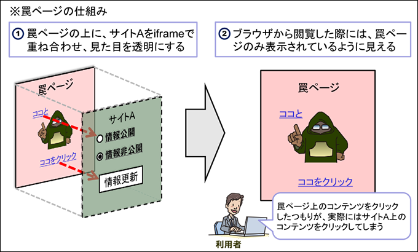

# Click jacking

悪意のあるリンクを無意識にクリックさせる攻撃手法のこと。

攻撃者がウェブサイト内のボタンや正規のページに悪意のあるリンクを埋め込むことで、ユーザーが正規のリンクをクリックするたびにそのユーザーの機密情報を抜き出す。

例えば、以下のように悪意のあるリンクを持つ iframe を透明にして罠サイトの上に重ねることで、ユーザーは罠サイト上の指示に従った結果 iframe 上の操作を進めてしまう。

## 解決策

以下を設定すれば良いらしい

- CSP(Content Security Policy)
- Set-Cookie 属性

それぞれを調べたら別途記載していく

## 参考

- [安全なウェブサイトの作り方 - 1.9 クリックジャッキング | 情報セキュリティ | IPA 独立行政法人 情報処理推進機構](https://www.ipa.go.jp/security/vuln/websecurity/clickjacking.html)
- [Clickjacking - ウェブセキュリティ | MDN](https://developer.mozilla.org/ja/docs/Web/Security/Attacks/Clickjacking)
