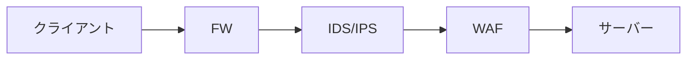

# WAF

## 概要

IDS, IPS は主にネットワーク層〜トランスポート層の異常を検知するため、XSS や SQL インジェクションのような Web アプリケーション固有の攻撃には対応しにくい。

このような攻撃対策の一環として、アプリケーション層でやり取りされるデータの中身を見て悪意のあるデータが含まれていないかをチェックするのが WAF(Web Application Firewall)の役割。

クライアントからサーバーまでの通信フロー的には以下のようになる。

WAF を通過させるかどうかの判断は大きくブロックリスト方式と許可リスト方式の2種類がある。

### ブロックリスト方式

IDS のシグネチャ型同様に、特定パターンのデータを持つ通信を遮断する。

遮断するパターンは拒否リストと呼ばれ、一般には WAF の開発元が提供するものを利用する。リストに載ってないパターンには対応できないため、新たな攻撃手法が発見された場合などに弱い。

### 許可リスト方式

正常なデータパターン（許可リスト）に載っている通信のみを通す。

高セキュリティな反面、正確な許可リストを作成しておかないと本来正常とされる通信も遮断される。

許可リストの作成には専門的知識を要す他、専用の運用サービスを検討するなども考えられるため、運用コストが高い。

## 参考

- [WAFとは？わかりやすく解説 | Cloudflare](https://www.cloudflare.com/ja-jp/learning/ddos/glossary/web-application-firewall-waf/)
- [イラスト図解式 この一冊で全部わかるWeb技術の基本 第2版](https://www.sbcr.jp/product/4815625948/)
  - P.154, 155
