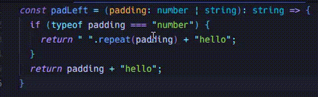

# Narrowing

## 概要

以下のように引数で宣言されている型に対し、型ガード ( `typeof` ) などでより具体的な型に絞り込む処理のこと。

```typescript
// 公式ドキュメントにある記述をより簡素にしたもの
const padLeft = (padding: number | string): string => {
  if (typeof padding === "number") {
    return " ".repeat(padding) + "hello";
  }
  return padding + "hello";
}
```

多くのエディタ上では、 Narrowing された後の型が確認できる。以下は上記サンプルコードを Narrowing した結果が表示されている。




## Narrowing のパターン

### `typeof` による型ガード

上記の例にあるような `typeof` 演算子を用いた方法のこと。

TS の場合、以下のいずれかの文字列を返すことが期待されている。

- `"string"`: 文字列型
- `"number"`: 数値型
- `"bigint"`: 長整数型
- `"boolean"`: 論理型
- `"symbol"`: シンボル型
- `"undefined"`: undefined
- `"function"`: 関数オブジェクト（クラスも関数扱いになる）
- `"object"`: その他のオブジェクト（e.g. 配列）

```ts
const typeOfSample = (param: string | number | boolean) => {
  if (typeof param === "string") {
    console.log(`${param} is string`);
  } else if (typeof param === "number") {
    console.log(`${param} is number`);
  } else if (typeof param === "boolean") {
    console.log(`${param} is boolean`);
  } else {
    // 引数の型に対して全てを網羅しているため、 never 型を返す（そして網羅が出来ている場合は観測不可）
    console.log(`${param} is never`);
  }
}
```

注意点として、 `null` の場合は `object` として判定される。どうやら JS の過去の仕様によるものらしい。

```ts
const objOrNull = Math.random() < 0.5 ? { foo: 123 } : null;

// objOrNull が null でも true として判定されてしまう
if (typeof objOrNull === "object") console.log(objOrNull);
```

### 真理値による型絞り込み

JS での `if` 文などの条件式は、自動的に `boolean` 型に変換し解釈される。その結果が `true` か `false` かによって分岐処理が実行される。

この変換結果で `false` となるものを `falsy` な値, `true` となるものは `truthy` な値と称される。

具体的には、以下の値は `falsy` で、それ以外が `truthy` である。

- `false`
- `0`
- `-0`
- `NaN`
- `""`（空文字列）
- `0n`（bigint型のゼロ）
- `null`
- `undefined`

`typeof` を使う場合 `null` は `"object"` として扱われるという話だったが、以下のように書けば判定が適切に行えることになる。

```typescript
// 備考: 配列は typeof で "object" として判別される
const checkNullSample = (input: string | string[] | null) => {
  // if (input) とすることで null を弾く
  if (input && typeof input === "object") {
    console.log(input); // string[]
  } else if (typeof input === "string") {
    console.log(input); // string
  } else {
    console.log(input); // null
  }
};
```

### 等価性による絞り込み

`switch` 文や `===`, `!=` などの等価比較演算子を用いることで判別する方法。

上記までで示した `typeof input === "string"` もこれの1種と言えるため、具体例は割愛する。

### `in` 演算子による絞り込み

`in`は JS の提供する、オブジェクトまたはプロトタイプチェーン（具体は割愛するが[この辺の話](https://developer.mozilla.org/ja/docs/Web/JavaScript/Guide/Inheritance_and_the_prototype_chain)を読むと良いっぽい）に特定の名前のプロパティが存在するかを確認する演算子のこと。

これを使うと特定のプロパティの有無から形の絞り込みが行える。

```typescript
// 公式ドキュメントより
type Fish = { swim: () => void };
type Bird = { fly: () => void };

function move(animal: Fish | Bird) {
  if ("swim" in animal) {
    return animal.swim(); // ここでの animal は Fish となる
  }

  return animal.fly(); // ここは Bird になる
}
```

ちなみにどちらにも存在しない場合は `unknown` 型として判定されるようだ。

```typescript
type Fish = { swim: () => void };
type Bird = { fly: () => void };

function move(animal: Fish | Bird) {
  if ("walk" in animal) {
    // 'animal.walk' is of type 'unknown'. ts(18046)
    return animal.walk();
  }
}
```

### `instanceof` の利用

これも JS の提供する演算子で、値が別の値のインスタンスかを判定するもの。

例えば以下のように、変数があるクラスのインスタンスの場合、そのクラスのインスタンス変数を呼び出すというような書き方ができる。

```typescript
const dateInstanceOrString = Math.random() < 0.5 ? new Date() : "I'm string type";

if (dateInstanceOrString instanceof Date) {
  console.log(dateInstanceOrString.toUTCString());
} else {
  console.log(dateInstanceOrString);
}
```

( 使い所ピンときてないけど、factory パターンのようなケースだと使えるかも？ )

### 代入演算

ある時点で複数の型を取り得る変数がある

```typescript
let x: string | number;
```

この変数への代入が有効（上記値 `x` だと `string` or `number` が代入）な場合、代入した値に応じて型が絞り込まれる。

要するに以下に示すような事が起きている。

```typescript
let x: string | number; // ここでは string | number 型

x = 'hoge';
console.log(x) // 'hoge' が代入されたことでこの時点では string 型として扱われる

x = 123;
console.log(x) // '123 が代入されたことでこの時点では number 型として扱われる

// ちなみに宣言時の型に含まれていない型を代入するとエラーになる
x = true; // => Type 'boolean' is not assignable to type 'string | number'.ts(2322)
```

ということは、裏側では宣言時の型と代入時の型を照らし合わせる処理が起きていることになる。

```typescript
// すっごいシンプルに書くと多分こんな感じで、上記例を元にすると
// declarationTypes: ["string", "number"]
// assignmentType: 代入された値が "hoge" のときは "string", 123 のときは"number", true のときは "boolean" が入る
const isValid = (declarationTypes: string[], assignmentType: string): boolean => assignmentType in declarationTypes;
```

### 型述語の利用

関数の戻り値の型注釈を `parameter is Type` な形式で記述することで、独自の型ガードを行うことができる。

これの嬉しいポイントは、複雑な型判定ロジックの抽象化や再利用性の向上にある。

例えば値が定義されていたら何らかの処理を行いたいとする

```typescript
const processString = (text: string | null | undefined) => {
  if (text !== null && text !== undefined) {
    console.log(text.toUpperCase());
  }
}

const processNumber = (value: number | null | undefined) => {
  if (value !== null && value !== undefined) {
    console.log(value.toFixed(2));
  }
}
```

この判定ロジックを型述語を使うことで以下のように書ける。

```typescript
const isDefined = <T>(value: T | null | undefined): value is T => value !== null && value !== undefined;

const processString = (text: string | null | undefined) => {
  if (isDefined(text)) {
    console.log(text.toUpperCase()); // text は string
  }
}

const processNumber = (value: number | null | undefined) => {
  if (isDefined(value)) {
    console.log(value.toFixed(2)); // value は number
  }
}
```

型述語を使わない判定ロジックで書くと narrowing されない。

```typescript
// 戻り値の型注釈を boolean にする
const isDefined = <T>(value: T | null | undefined): boolean => value !== null && value !== undefined;

const processString = (text: string | null | undefined) => {
  if (isDefined(text)) {
    console.log(text.toUpperCase()); // text は string | null | undefined でこの処理がエラーになる
  }
}

const processNumber = (value: number | null | undefined) => {
  if (isDefined(value)) {
    console.log(value.toFixed(2)); // value は number | null | undefined でこの処理がエラーになる
  }
}
```

### アサーション関数の利用

アサーション関数自体の説明は省略するが、簡単に書くと以下のように `asserts value is Type` な構文を関数の戻り値の型注釈に渡すことで narrowing が行われる。

```typescript
function assertDefined<T>(value: T | null | undefined): asserts value is T {
  if (value === null || value === undefined) {
    throw new Error("Value is null or undefined");
  }
}

const processString = (text: string | null | undefined) => {
  console.log(text); // text は string | null | undefined 型
  assertDefined(text);

  // この行以降、text は string 型として扱われる
  console.log(text.toUpperCase());
};
```

型述語は真偽値を返すが、アサーション関数は `void` で、代わりに関数が正常終了したかどうかがで以降の処理へ進めるかが決まる。

例外処理を組み合わせる場合はこちらを、そうでなければ型述語を使うという使い分けになる…はず。

### 判別可能なユニオン型

共通のプロパティ（判別子と称する）を持つ複数の方の組み合わせで、判別子の値から型を絞り込むことができる。

API レスポンスを例に書くと以下の通り。

```typescript
// 判別子として status を定義する
type SuccessResponse = {
  status: "success";
  data: {
    id: number;
    name: string;
  };
};

type ErrorResponse = {
  status: "error";
  error: {
    code: number;
    message: string;
  };
};

type LoadingResponse = {
  status: "loading";
};

type ApiResponse = SuccessResponse | ErrorResponse | LoadingResponse;

const handleResponse = (response: ApiResponse) => {
  // 判別子の値によって narrowing される
  switch (response.status) {
    case "success":
      console.log(`データ取得成功: ${response.data.name}`); // response は SuccessResponse 型
      break;
    case "error":
      console.error(`エラー: ${response.error.message}`); // response は ErrorResponse 型
      break;
    case "loading":
      console.log(`status is ${response.status}`); // response は LoadingResponse 型
      break;
  }
}
```

## never 型について

型の絞り込みにおいてユニオン型の選択肢を全て排除して、残る選択肢が存在しない状態を作り出すことができる。

この場合、 Typescript は存在しないはずの状態の表現として `never` 型を使用する

```typescript
const typeOfSample = (param: string | number) => {
  if (typeof param === "string") {
    console.log(`${param} is string`);
  } else if (typeof param === "number") {
    console.log(`${param} is number`);
  } else {
    // この関数は string, number を取り得るが、この if 文では string, number に関する分岐が行われている
    // つまりここに到達する選択肢がない状態になる → param は never 型になる
    console.log(`${param} is never`);
  }
}
```

ちなみに `else` 節で `param` を `never` 型の変数として割り当てると、引数の型が増えたときにエラーが発生してくれる。

つまり、以下のような書き方を追加しておく。

```typescript
else {
  const exhaustiveCheck: never = param;
  console.error(`${param} is never`);
}
```

これによって、引数の取り得る型が増えても安全というわけである。

```typescript
const typeOfSample = (param: string | number | boolean) => { // boolean が増えた
  if (typeof param === "string") {
    console.log(`${param} is string`);
  } else if (typeof param === "number") {
    console.log(`${param} is number`);
  } else {
    // never しか受け入れないのに boolean が入り得てしまうことで型エラーが発生
    // → 何らかの対応が必要なことが早期に分かる
    const exhaustiveCheck: never = param;
    console.error(`${param} is never`);
  }
}
```

## 備考

型述語、あるいはアサーション関数は型強制に繋がるので注意すること。

どういうことかというと、以下のような誤った書き方になっていても Typescript は警告してくれない。

```typescript
// value が undefined だった value is string は true になるという誤りを起こしている
const isDefined = (value: string | null | undefined): value is string => typeof value === "undefined";

const processString = (text: string | null | undefined) => {
  // text が undefined なら text.toUpperCase() をすることになってしまう
  if (isDefined(text)) {
    console.log(text.toUpperCase());  // ここの text は string として解釈されてしまっている
  }
}

processString(undefined); // なので、この処理は実行されて初めてエラーだと分かる
```

## 参考

- [TypeScript: Documentation - Narrowing](https://www.typescriptlang.org/docs/handbook/2/narrowing.html)
- [Narrowing Pattern](https://zenn.dev/estra/articles/typescript-narrowing-patterns)
- [継承とプロトタイプチェーン - JavaScript | MDN](https://developer.mozilla.org/ja/docs/Web/JavaScript/Guide/Inheritance_and_the_prototype_chain)
- [型ガード関数 (type guard function) | TypeScript入門『サバイバルTypeScript』](https://typescriptbook.jp/reference/functions/type-guard-functions)
- [アサーション関数 (assertion functions) | TypeScript入門『サバイバルTypeScript』](https://typescriptbook.jp/reference/functions/assertion-functions)
- [TypeScript 3.7の`asserts x is T`型はどのように危険なのか #TypeScript - Qiita](https://qiita.com/uhyo/items/b8d2ea6fbf6214fc4194)
